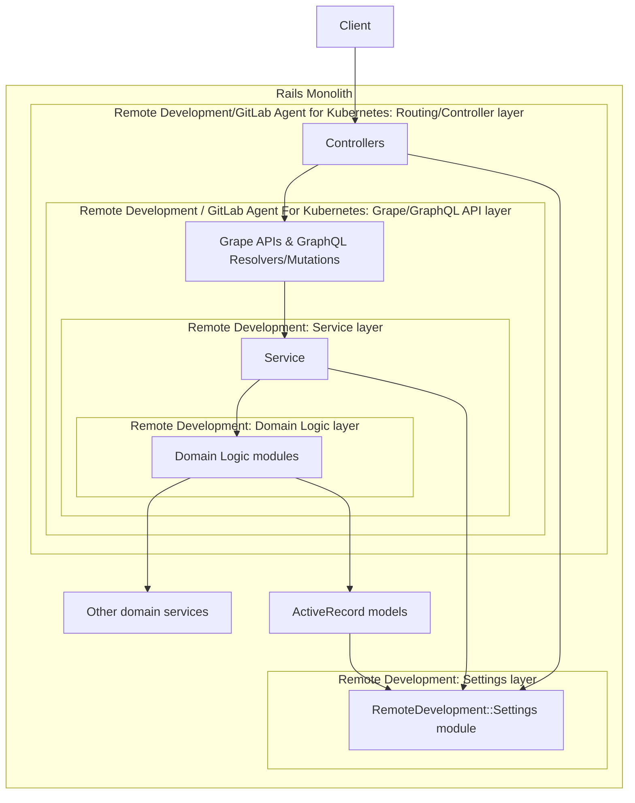

# Remote Development Rails domain developer documentation: `ee/lib/remote_development` overview

## Table of Contents

- [TL;DR and Quickstart](#tldr-and-quickstart)
  - [Videos](#videos)
- [Overview](#overview)
  - [Layered architecture](#layered-architecture)
  - [Avoid coupling Domain Logic layer to Rails application](#avoid-coupling-domain-logic-layer-to-rails-application)
- [Type safety](#type-safety)
  - [Type checking](#type-checking)
  - [Union types](#union-types)
  - [Pattern matching with types](#pattern-matching-with-types)
    - [Case statements with types](#case-statements-with-types)
    - [Rightward assignment pattern matching and destructuring with types](#rightward-assignment-pattern-matching-and-destructuring-with-types)
    - [Pattern matching and destructuring without types](#pattern-matching-and-destructuring-without-types)
  - [Null safety](#null-safety)
  - ["Type signatures" in Ruby without a type system](#type-signatures-in-ruby-without-a-type-system)
- [Functional patterns](#functional-patterns)
  - [Immutable state](#immutable-state)
  - [Higher order functions](#higher-order-functions)
  - [Pure functions](#pure-functions)
  - [Concurrency and parallelism](#concurrency-and-parallelism)
  - [Error handling](#error-handling)
- [Object-Oriented patterns](#object-oriented-patterns)
  - [Value objects](#value-objects)
  - [Code sharing patterns and DRYness](#code-sharing-patterns-and-dryness)
- [Other patterns](#other-patterns)
  - [Inversion of control](#inversion-of-control)
  - [Metaprogramming](#metaprogramming)
  - [Constant declarations](#constant-declarations)
  - [Validation strategy](#validation-strategy)
- [Railway Oriented Programming and the Result class](#railway-oriented-programming-and-the-result-class)
  - [Result class](#result-class)
  - [Message class and Messages module](#message-class-and-messages-module)
    - [What types of errors should be handled as domain Messages?](#what-types-of-errors-should-be-handled-as-domain-messages)
  - [ROP code examples](#rop-code-examples)
    - [API layer code example](#api-layer-code-example)
    - [Service layer code example](#service-layer-code-example)
    - [Domain layer code examples](#domain-layer-code-examples)
  - [Passing information along the ROP chain](#passing-information-along-the-rop-chain)
- [Enforcement of patterns](#enforcement-of-patterns)
- [Testing levels for the Workspaces feature](#testing-levels-for-the-workspaces-feature)
- [Testing ROP main classes](#testing-rop-main-classes)
  - [Matcher API](#matcher-api)
    - [Matcher entry](#matcher-entry)
    - [Matcher chain methods](#matcher-chain-methods)
  - [Matcher internals](#matcher-internals)
- [Local smoke test suite](#local-smoke-test-suite)
- [Debugging](#debugging)
- [Benefits](#benefits)
  - [Loose coupling, high cohesion](#loose-coupling-high-cohesion)
  - [No need to write or test service classes](#no-need-to-write-or-test-service-classes)
  - [More likely that you can use fast\_spec\_helper](#more-likely-that-you-can-use-fast_spec_helper)
  - [Easier for Everyone to Contribute](#easier-for-everyone-to-contribute)
- [Differences from standard GitLab patterns](#differences-from-standard-gitlab-patterns)
  - [Minimal Service Layer](#minimal-service-layer)
  - [Stateless classes](#stateless-classes)
  - ['describe #method' RSpec blocks are usually unnecessary](#describe-method-rspec-blocks-are-usually-unnecessary)
- [Remote Development Settings](#remote-development-settings)
  - [Overview of GitLab::Fp settings module support](#overview-of-gitlabfp-settings-module-support)
  - [Adding a new default setting](#adding-a-new-default-setting)
  - [Adding support for overriding a setting](#adding-support-for-overriding-a-setting)
  - [Reading settings](#reading-settings)
  - [Precedence of settings](#precedence-of-settings)
  - [Usage of ENV vars to override settings at the instance level](#usage-of-env-vars-to-override-settings-at-the-instance-level)
- [`workspaces_agent_configs` versioning](#workspaces_agent_configs-versioning)
  - [How is `workspaces` linked with versioned `workspaces_agent_configs`?](#how-is-workspaces-linked-with-versioned-workspaces_agent_configs)
- [Using the DeclarativePolicy authorization framework](#using-the-declarativepolicy-authorization-framework)
  - [DeclarativePolicy guidelines](#declarativepolicy-guidelines)
  - [Testing DeclarativePolicy authorization policies](#testing-declarativepolicy-authorization-policies)
  - [Guidelines for writing tests using this pattern](#guidelines-for-writing-tests-using-this-pattern)
- [Coding standards for Remote Development domain](#coding-standards-for-remote-development-domain)
- [FAQ](#faq)
  - [Why is the Result class in the top level lib directory?](#why-is-the-result-class-in-the-top-level-lib-directory)
  - [What are all the `noinspection` comments in the code?](#what-are-all-the-noinspection-comments-in-the-code)

## TL;DR and Quickstart

- All the domain logic lives under `ee/lib/remote_development` in the "Domain Logic layer". Unless you are changing the DB schema or API structure, your changes will probably be made here.
- The `Main` class is the entry point for each sub-module, and is found at `ee/lib/remote_development/**/main.rb`
- Have a look through the ["Railway Oriented Programming"](https://fsharpforfunandprofit.com/rop/) presentation slides (middle of that page) to understand the patterns used in the Domain Logic layer.
- Prefer `ee/spec/lib/remote_development/fast_spec_helper.rb` instead of `spec_helper` where possible. See [Avoid coupling Domain Logic layer to Rails application](#avoid-coupling-domain-logic-layer-to-rails-application).
- Use `scripts/remote_development/run-smoke-test-suite.sh` locally, to get a faster feedback than pushing to CI and waiting for a build. See ["Local smoke test suite"](#local-smoke-test-suite) for more details.
- Use `scripts/remote_development/run-e2e-tests.sh` to easily run the QA E2E tests.
- If you use [RubyMine](https://handbook.gitlab.com/handbook/tools-and-tips/editors-and-ides/jetbrains-ides/rubymine/), you will get a lot of extra help, because we try to keep the `Inspect Code` clean and green for all Remote Development files, and also maintain YARD annotations, which means you will get fast in-IDE feedback about many errors such as type violations, etc, which are not caught by the standard Gitlab static linters such as RuboCop, ESLint, etc.

### Videos

- A Knowledge Sharing session, covering most of the topics covered in this README: https://www.youtube.com/watch?v=RJrBPbBNE9Y
- A recording of a backend pairing session, where Chad presents an overview of the Remote Development architecture, covering several of the topics and patterns discussed below in this README: https://www.youtube.com/watch?v=Z6n7IKbtuDk
  - Note that in the second half of this video includes speculation on how the reconciliation logic will be redesigned to work with Railway Oriented Programming, but the [final implementation ended up looking a bit different](https://gitlab.com/gitlab-org/gitlab/-/merge_requests/126785) (and simpler).

## Overview

### Layered architecture

In the Remote Development feature, we strive to maintain a clean, layered architecture with the business logic at the center.



The layers are designed to be _loosely coupled_, with clear interfaces and no circular dependencies, to the extent this is possible within the current GitLab Rails monolith architecture.

An example of this is how we avoid coupling the Domain Logic layer to the Service layer's `ServiceResponse` concern, which would technically be a circular dependency, since the `ServiceResponse` is owned by the Service layer. Instead of using the ServiceResponse class directly in the Domain Logic layer, we have the Domain Logic layer return a hash with the necessary entries to create a ServiceResponse object. This also provides other benefits. See the comments in [`ee/app/services/remote_development/service_response_factory.rb`](https://gitlab.com/gitlab-org/gitlab/-/blob/master/ee/app/services/remote_development/service_response_factory.rb#L12-12) for more details.

We also minimize the amount of logic that lives in the ActiveRecord models, and keep them as thin and dumb as possible. The only logic that currently lives on the models is related to ActiveRecord validations,
ActiveRecord lifecycle hooks, and simple aliases such as the `Workspace#url` method, which only does string concatenation. And if any of this logic in the models were to become more complex,
it should be extracted out to the Domain Logic layer where it can be decoupled and unit tested in isolation.

This overall approach is aligned with [our direction towards a more modular monolith](https://docs.gitlab.com/ee/architecture/blueprints/modular_monolith/). See that document for more information on
the motivations and patterns. Specifically, see the `References` sub-page and reference to the the [`hexagonal architecture ports and adapters`](https://www.google.com/search?q=hexagonal+architecture+ports+and+adapters&tbm=isch) pattern, which includes [this article with an example of this architecture](https://herbertograca.com/2017/11/16/explicit-architecture-01-ddd-hexagonal-onion-clean-cqrs-how-i-put-it-all-together/)

### Avoid coupling Domain Logic layer to Rails application

This layered approach also implies that we avoid directly referring to classes which are part of the Rails application from within the Domain Logic layer.

If possible, we prefer to inject instances of these classes, or the classes themselves, into the Domain Logic layer from the Service layer.

This also means that we can use `ee/spec/lib/remote_development/fast_spec_helper.rb` in most places in the Domain Logic layer. However, we may use the normal `spec_helper` for Domain Logic classes which make direct use of Rails. For example, classes which directly use ActiveRecord models and/or associations, where the usage of `fast_spec_helper` would require significant mocking, and not provide as much coverage of the ActiveRecord interactions.
See [this thread](https://gitlab.com/gitlab-org/gitlab/-/merge_requests/126785#note_1494395384) for a more detailed discussion of when/why to use `fast_spec_helper` or not.

## Type safety

The Remote Development domain leverages type safety where _possible and pragmatic_.

We also refer to this approach as being **"as type safe as _profitable_"**.

This allows us to have some run-time safety nets in addition to test coverage, and also helps RubyMine provide useful warnings when the wrong types are used.

Although Ruby is traditionally weakly-typed, without null safety and little support for type inference, there are several options to achieve a type safety net, especially since the 3.0 release.

### Type checking

- We use [**YARD annotations**](https://yardoc.org/) for method signatures. This is used to provide warnings in IDEs such as RubyMine when incorrect types are being used. We are currently trying this out, we may not continue, or we may replace or augment it with other type safety approaches in the future.
- We do not attempt to use RBS or Sorbet (yet), as these require a more extensive investment and wider impacting changes, so any work in this area should be coordinated with the rest of the codebase.

### Union types

We also simulate ["Union Types"](https://en.wikipedia.org/wiki/Union_type) in Ruby. We do this through the use of a module which defines multiple class constants of the same type. The `RemoteDevelopment::Messages` module is an example of this.

### Pattern matching with types

#### Case statements with types

- The `case ... in` structure can be used to pattern-match on types. When used with the approach of throwing an exception in the `else` clause, this can provide exhaustive type checking at runtime.

#### Rightward assignment pattern matching and destructuring with types

Example: Given a `Hash` `x` with an entry `y` which is an `Integer`, the following code would destructure the integer into `i`:

```ruby
x = {y: 1}
x => {y: Integer => i}
puts i # 1
```

If `y` was not an integer type, a `NoMatchingPatternError` runtime exception with a descriptive message would be thrown:

```ruby
x = {y: "Not an Integer"}
x => {y: Integer => i} #  {:y=>"Not an Integer"}: Integer === "Not an integer" does not return true (NoMatchingPatternError)
```

- This is a powerful new feature of Ruby 3 which allows for type safety without requiring the use of type safety tools such as RBS or Sorbet.
- Although rightward pattern matching with types is still an [experimental feature](https://rubychangelog.com/versions-latest/), it has been stable with [little negative feedback](https://bugs.ruby-lang.org/issues/17260)).
- Also, Matz has [stated his committment to the support of rightward assignement for pattern matching](https://bugs.ruby-lang.org/issues/17260#note-1).
- But even if the experimental support for types in rightward assignment was removed, it would be straightforward to change all occurrences to remove the types and go back to regular rightward assignment. We would just lose the type safety.

Also note that `#deconstruct_keys` must be implemented in order to use these pattern matching features.

However, note that sometimes we will avoid using this type of hardcoded type checking, if it means that
we will be able to use `fast_spec_helper`, and there is otherwise sufficient test coverage to ensure
that the types are correct. See [this comment thread](https://gitlab.com/gitlab-org/gitlab/-/merge_requests/126785#note_1494395384) for a more detailed discussion.

#### Pattern matching and destructuring without types

Also note that the destructuring a hash or array, even without the type checks (e.g. `x => {y: i}`), is still a form of type safety, because it will raise a `NoMatchingPatternKeyError` exception if the hash or array does not have the expected structure.

#### Pattern matching with arrays

This approach can also be used with structures that are a mix of arrays and hashes. In this example, the call to `#find`
to search for a matching hash within an array can be replaced with
an equivalent pattern matching structure which uses the `*_` syntax to match any number of elements.

```ruby
haystack = [
  { type: :straw, value: :nope },
  { type: :needle, value: "FOUND IT!" },
  { type: :dirt, value: :nope },
]

puts haystack.find { |item| item.fetch(:type) == :needle }.fetch(:value)
# => "FOUND IT!"

haystack => [
  *_,
  { type: :needle, value: value },
  *_
]
puts value
# => "FOUND IT!"

begin
  haystack.find { |item| item.fetch(:type) == :gold }.fetch(:value)
rescue => e
  # Less descriptive error message:
  p e
  # #<NoMethodError: undefined method `fetch' for nil>
end

begin
  haystack => [
    *_,
    { type: :missing_gold, value: String => value },
    *_
  ]
rescue => e
  # More descriptive error message:
  p e
  # #<NoMatchingPatternError: [{:type=>:straw, :value=>:nope}, {:type=>:needle, :value=>"FOUND IT!"}, {:type=>:dirt, :value=>:nope}]: [{:type=>:straw, :value=>:nope}, {:type=>:needle, :value=>"FOUND IT!"}, {:type=>:dirt, :value=>:nope}] does not match to find pattern>
end
```

This approach can also be used to concisely replace combinations of `#find` and `#dig` for deeply-nested
structures.

```ruby
array = [
  { key: 1 },
  {
    key: 2,
    a: {
      b: {
        value: "The value",
      }
    }
  },
  { key: 3 }
]

value = array.find { |item| item.fetch(:key) == 2 }.dig(:a, :b, :value)
puts value.length
# => 9

array => [
  *_,
  {
    key: 2,
    a: {
      b: {
        value: value
      }
    }
  },
  *_
]
puts value.length
# => 9
```

#### Type safety for hash keys: `#dig` vs. pattern matching vs. `#fetch`

In cases where the expected key is not found, pattern matching will fail with a descriptive error, where
`#dig` will just return `nil`:

```ruby
array = [
  { key: 1 },
  {
    key: 2,
    a: {
      b: {
        value: "The value",
      }
    }
  },
  { key: 3 }
]

# With #dig, an incorrect key will allow nil to be returned:
value = array.find { |item| item.fetch(:key) == 2 }.dig(:MISSING, :b, :value)
begin
  puts value.length
rescue => e
  # No null-safety, less descriptive error message:
  p e
  # #<NoMethodError: undefined method `length' for nil>
end

# With pattern matching, an incorrect key will raise a descriptive error:
begin
  array => [
    *_,
    {
      key: 2,
      MISSING: {
        b: {
          value: value
        }
      }
    },
    *_
  ]
rescue => e
  # More descriptive error message:
  p e
  # #<NoMatchingPatternError: [{:key=>1}, {:key=>2, :a=>{:b=>{:value=>"The value"}}}, {:key=>3}]: [{:key=>1}, {:key=>2, :a=>{:b=>{:value=>"The value"}}}, {:key=>3}] does not match to find pattern>
end
```

You can also get null-safety if the `#dig` is replaced with multiple chained `#fetch` calls.

This gives a more descriptive error message than dig, but it is different than pattern matching.
`#fetch` will tell you the missing key, but won't print out the full data structure for you to look
at. Pattern matching doesn't tell you the missing key, but will print out the full data structure.

```ruby
array => [
  *_,
  {
    key: 2,
    a: {
      b: {
        value: value
      }
    }
  },
  *_
]

# You can get nil safety by using #fetch instead of #dig
begin
  array.find { |item| item.fetch(:key) == 2 }.fetch(:a).fetch(:MISSING).fetch(:value)
rescue => e
  p e
  # #<KeyError: key not found: :MISSING>
end
```

You can choose which is more appropriate for your use case.

#### Usage of variables in pattern matching

You can also use variables in pattern matching. In the following example, `id_to_find` is used in
the pattern match via
[the `^` pattern operator](https://docs.ruby-lang.org/en/master/syntax/pattern_matching_rdoc.html#label-Appendix+A.+Pattern+syntax)

```ruby
id_to_find = 2
hash = [{ id: 1, value: "a" }, { id: 2, value: "b" }, { id: 3, value: "c" }]
hash => [
  *_,
  {
    id: ^id_to_find,
    value: value
  },
  *_
]
puts value # => b
```

You can also use expressions via the `^(....)` pattern operator:

```ruby
major_release = 1
minor_release = 2
hash = [{ id: "1.1", value: "a" }, { id: "1.2", value: "b" }, { id: "1.3", value: "c" }]
hash => [
  *_,
  {
    id: ^("#{major_release}.#{minor_release}"),
    value: value
  },
  *_
]
puts value # => b
```

#### Do not use type safety on unvalidated user-provided values

We do not want to use type safety on values which come directly from user input, and have not yet been validated.
For example, values from the API which will be used to create or update an ActiveRecord model instance.
This applies to both rightward assignment pattern matching with types, as well as using `#fetch` for hashes.

This is because the error from the type failure will not be user-friendly when it is displayed back to the user
(in the API errors or Web UI).

Instead, you should just let the ActiveRecord model handle all of the validation rules, because that will generate
nicely formatted and descriptive user-facing messages (and if it doesn't then it should).

If you are dealing with values from user input in a scenario where you _cannot_ rely on ActiveRecord validation,
then you should manually perform validations and return any validation errors as nicely-formatted messages.
You can still probably use `ActiveModel::Validations` for this even if an actual ActiveRecord model is not involved.

### Null safety

When accessing a `Hash` entry by key (outside of pattern matching), where we expect that the value must present, we prefer to use `Hash#fetch`
instead of `Hash#[]`.

### "Type signatures" in Ruby without a type system

So, in the absence of a real type system like RBS, we can consider the above patterns as **_achieving a similar effect to a type signature in a typed language_**.

This is because this type+existence checking ensures that the type requirement(s) of a cohesive method are met.

As we'll see below in the section on Railway Oriented Programming, this serves the same purpose as the typed F# signatures of the "internal" functions of the [Domain Modeling Made Functional](https://pragprog.com/titles/swdddf/domain-modeling-made-functional/) book's examples, which _do_ specify their explicit dependencies.

This may be a strange concept to people coming from compiled languages, because in Ruby this _does_ happens at runtime, like everything else in an interpreted language like Ruby.

Because of this nature of Ruby, we lean into [enforcement of patterns at runtime](#enforcement-of-patterns).

But, we also have strict adherence to thorough testing at multiple levels of the testing pyramid, which ensures that this type-checking code is always executed during development/CI.

Thus, when viewed holistically, if you squint at it in the right way, this approach is acting as a sort of "type-safe compiler".

**_But remember that this "compiler" is only as good as your manual type checks and test coverage!_**

## Functional patterns

The domain layer of the Remote Development feature uses some Functional Programming patterns.

Although these patterns may not be common in Rails apps or the GitLab Rails monolith, they fully supported in Ruby, and are commonly used in many other languages, including other lanaguages used within GitLab, such as Javascript, Golang, and Rust. The functional patterns have benefits which we want to leverage, such as the following.

However, we try to avoid functional patterns which would add little value, and/or could be confusing and difficult to understand even if technically supported in Ruby. [`currying`](https://www.rubydoc.info/stdlib/core/Method:curry) would be an example of this.

### Immutable state

Wherever possible, we use immutable state. This leads to fewer state-related bugs, and code which is easier to understand, test, and debug. This is a common pattern, and many widely used frameworks, such as Redux and Vuex, use immutable state or controls around how state can be mutated. Immutability is also the basis of architectures such as Event Sourcing, which we [may consider for some GitLab features/domains in the future as we move towards a modular monolith](https://docs.gitlab.com/ee/architecture/blueprints/modular_monolith/references.html#reference-implementations--guides).

We enforce imutability through the usage of patterns such as [pure functions and the usage of of "singleton" (or class) methods](#pure-functions).

However, we still mutate objects in some cases _where it makes sense in the context of our patterns_. For example, the mutable context object which is used when [Passing information along the ROP chain](#passing-information-along-the-rop-chain), and this results in concise and simple code.

_Usually_, mutating parameters which are passed to a method/function is "Not A Good Idea". However, in this case, due to the nature of the architecture and these patterns as we currently use them, there is minimal risk. There would also be a risk of increased performance over if we attempted to enforce immutability. One way to frame this topic is by thinking about how we could enforce `call-by-value` vs. `call-by-reference`, and more importantly, where and when _should_ try to enforce it. Note that Ruby uses "pass by object reference", as explained by [this stackoverflow answer](https://stackoverflow.com/a/23421320/25192). See [this thread](https://gitlab.com/gitlab-org/gitlab/-/merge_requests/150208#note_1875548528) for an extensive discussion on this topic.

### Higher order functions

["Higher order functions"](https://en.wikipedia.org/wiki/Higher-order_function) are the basis of many (or most) functional patterns. Ruby supports this by allowing lambdas, procs, or method object references to be passed as arguments to other methods.

In the Remote Development feature, we accomplish this by passing lambdas or "singleton" (class) `Method` objects as arguments.

Note that we do not use procs (and enforce their non-usage), because of their behavior with regard to arguments and the `return` keyword.

### Pure functions

We rely on ["pure functions"](https://en.wikipedia.org/wiki/Pure_function), which are necessary to support and enforce functional patterns such as immutable state and higher order functions as described above.

Instance variables are are a form of state, and are incompatible with the usage of pure functions, so we avoid their usage except in ["value object"](#value-objects) classes, which are intended only to encapsulate state in an object, but have no business logic in the class.

In Ruby, higher order functions are implemented and enforced through the usage of "singleton" or class methods, which by definition do not allow the usage of constructors and instance variables, and therefore cannot contain or reference state (unless you try to set state in a class variable, which you should never do in the context of a Rails request anyway 😉).

So, this pattern of always using class methods for our business logic _intentionally prevents us_ from holding on to any mutable state in the class, which results in classes which are easier to debug and test. We also use this approach for "`Finder`" classes and other "standalone" classes.

### Concurrency and parallelism

By using patterns such as immutable state and pure functions, we are able to support concurrency and parallelism in the domain logic, which Ruby supports though various standard library features.

This may be useful in the future for the Remote Development feature, as operations such as reconciliation of workspace state involve processing data for many independent workspaces in a single request.

### Error handling

The domain logic of the Remote Development feature is based on the
["Railway Oriented Programming"](https://fsharpforfunandprofit.com/rop/) pattern, through the usage of a standard [`Result` class](https://gitlab.com/gitlab-org/gitlab/-/blob/master/lib/gitlab/fp/result.rb) as found in many programming languages (ours is based on the [Rust implementation](https://doc.rust-lang.org/std/result/index.html)).

This Railway Oriented Programming pattern allows us to keep the business logic decoupled from logging, error handling, and tracking/observability concerns, and chain these cohesive business logic operations together in a decoupled way.

## Object-Oriented patterns

Although the functional patterns above are used when they provide benefits, we otherwise still try to adhere to standard OO/Ruby/Rails idioms and patterns, for example:

### Value objects

When we need to pass data around, we encapsulate it in objects. This may be a standard libary class such as `Hash` or `String`, or it may be a custom class which we create.

The custom classes are a form of the ["Value Object](https://thoughtbot.com/blog/value-object-semantics-in-ruby) pattern. Currently, `Gitlab::Fp::Message` is the only example of this (NOTE: `error.rb` is also one, but it is being deprecated in favor of `Message`).

For these custom value object classes, the `#==` method should be implemented.

### Code sharing patterns and DRYness

Mixins (implemented as modules in standard Ruby or "concerns" in Rails) are a common pattern for sharing logic in Ruby and Rails, and keeping code [DRY](https://en.wikipedia.org/wiki/Don%27t_repeat_yourself)

We prefer mixins/modules instead of superclasses/inheritance for sharing code. This is because modules (which are actually a form of [multiple inheritance](https://en.wikipedia.org/wiki/Multiple_inheritance)) provide more flexibility than single inheritance.

In other cases, we do not use a mixin/module, but instead directly call a class/singleton method via `ClassName.method`. This has some benefits:

- Helps IDEs out with figuring out exactly what method is being called
- Make it simpler to reason about for people new to Ruby (don't have to understand the nuances of class vs. instance methods, and when to use `extend` vs. `include`)
- Encourages direct and dedicated unit testing of the class/singleton method, rather than relying on indirect testing via a class using a mixin/module.

However, we do use inheritance in the higher layers of the architecture where this is necessary confirm with existing patterns, e.g. in controllers or API classes.

## Other patterns

### Inversion of control

We use the pattern of "Inversion of Control" when applicable, to help achieve loose coupling between modules which implement business logic.

In our [pure functional approach with the usage of of "singleton" (or class) methods](#pure-functions), "Inversion of Control" means "injecting" the dependencies as arguments passed to the pure functions.

An example of this is how we inject all necessary dependencies into the beginning of a [Railway Oriented Programming](#railway-oriented-programming-and-the-result-class) (ROP) chain as entried in a single context object which is of type `Hash`. Then, all the steps of the ROP chain depend upon this for all of their context.

In many cases, these business logic classes _COULD_ use static method calls to obtain their dependencies (e.g. `Rails.logger`), but we intentionally avoid that in order to maintain the pure functional approach, and avoid coupling them to the Rails infrastructure or other classes outside of our domain. This has benefits in testability (e.g. facilitating wider usage of `fast_spec_helper`).

See more details and examples of this in the sections below.

### Metaprogramming

We _currently_ do not make heavy use of metaprogramming. But, we may make use of it in the future in areas where it makes sense.

### Constant declarations

- If a constant is only used in a single class or module, it should be declared within that class/module.
- If constants are used by multiple classes or modules, they are grouped in a single class at each Ruby module/namespace level corresponding to the domain use-case, at the lowest level at which they are used.
  For example, constants used only within `RemoteDevelopment::WorkspaceOperations::Create` will all be declared in `RemoteDevelopment::WorkspaceOperations::Create::CreateConstants` class.
  Likewise, constants shared across multiple sub-modules of `RemoteDevelopment::WorkspaceOperations` will be declared in `RemoteDevelopment::WorkspaceOperations::WorkspaceOperationConstants`
    - We could split these up in more specific classes (e.g. `FileConstants`, `EnvVarConstants`, etc.), but this results in several more classes in the domain code files, without much benefit.
      Grouping them in fewer files is easier, but scoping them by namespace still gives an indication of the scope where they are used.
      Note that there may be some exceptions to this.
      If we have many constants of a single category, we might decide to put them in their own file.
    - Even though we could name all the classes just `Constants`, naming them uniquely after their corresponding namespace level makes it easier to find them, and understand the scope to which they are limited.
    - Constants within a single file should be kept alphabetized. This is so no thought is required on how to group them - if grouping is desired, name them with the same prefix.
    - Spec/factory code may refer to constants from different modules than their own if necessary. The scoping rules only apply to usages within production code.
- Do not declare string constants which are only interpolated into other string constants, and are not used anywhere else. Instead, declare a single constant as single string.

### Validation strategy
The Remote Development domain uses three validation approaches, in order of preference:

1. Simple Active Record Validations - Built-in Rails validations defined directly in model classes
1. Custom Active Record Validator Classes - Ruby-based validator classes for more complex validations
1. JSON Schema Validations - Schema-based validations for complex nested data structures for checking the types/structure of nested objects

#### When to Use Each Approach
1. Simple Active Record Validations
- Use for basic attribute validations (presence, length, format, etc.)
- Example: `validates :name, presence: true, length: { maximum: 255 }`

2. Custom Active Record Validator Classes
- Use when validation logic is complex but can still be expressed in Ruby
- Use when validation logic needs to be reused across multiple models
- Location: `ee/app/validators/remote_development/`

3. JSON Schema Validations
- Use only when validating complex nested JSON structures that cannot be effectively validated with the other approaches
- Location: `ee/lib/remote_development/json_schemas/`
- Must have an Active Record Validator class to complement the JSON Schema
- Should avoid duplicating validation which is already covered by the ActiveRecord validations


Prefer Active Record validations when possible and JSON Schema validations only when Active Record validations cannot effectively handle the validation requirements.

Example

The `WorkspacesAgentConfig` model demonstrates this approach:

```ruby
  # ee/app/models/remote_development/workspaces_agent_config.rb
  module RemoteDevelopment
    class WorkspacesAgentConfig < ApplicationRecord
      # Active Record validations
      validates :agent, presence: true
      validates :dns_zone, hostname: true
      validates :enabled, inclusion: { in: [true, false] }
      
      # JSON Schema validation for complex nested structure
      validates :network_policy_egress,
        json_schema: { filename: 'workspaces_agent_configs_network_policy_egress' }
      
      # Custom validation using Ruby validator for business logic
      validates :network_policy_egress, 'remote_development/network_policy_egress': true
    end
  end
```
This tiered approach ensures we use the simplest, most maintainable validation method for each validation requirement while still ensuring data integrity.

#### Model-Layer Validation
All validations must be performed at the model layer, not in graphql/service objects. Service objects should:

- Use model validations - Call `valid?` or `save` on models and handle the resulting errors
- Not duplicate validation logic - Avoid reimplementing validations that belong in the model
- Focus on orchestration - Handle the workflow and coordination between models

This approach ensures:

- Single source of truth - Validation rules are defined in one place
- Consistent error handling - All validations use the same error collection mechanism
- Better maintainability - Changes to validation rules only need to be made in one place

### Using non-Ruby files in domain code

The `RemoteDevelopment::Files` module contains constants for all the files (default devfile, shell scripts, script fragments, commands, etc)
that are used in the Remote Development domain for various purposes, such as programatically injecting into container `ENTRYPOINT`/`CMD`, etc.
For example: `RemoteDevelopment::Files::MAIN_COMPONENT_UPDATER_CONTAINER_ARGS`.

The contents of these files are pulled out to separate files in the filesystem, instead of being hardcoded
via inline Ruby HEREDOC or other means. This allows them to have full support for syntax highlighting and refactoring in IDEs,
glob-based linting in CI (for example, running Shellcheck on all `**/*.sh`), etc.

The files themselves should ideally be placed close to the code which uses them, and use a similar filename, so that the file list
shows them right next to the code that uses them.

For example, the file with the shell script injected into the main container is located at
`ee/lib/remote_development/workspace_operations/create/workspace_variables_git_credential_store.sh`, and named
with the `workspace_variables_` prefix, because it is used in`ee/lib/remote_development/workspace_operations/create/devfile_fetcher.rb`.

## Railway Oriented Programming and the Result class

The Domain Logic layer uses the "Railway Oriented Programming" pattern (AKA "ROP"), which is [explained here in a presentation and video](https://fsharpforfunandprofit.com/rop/) by Scott Wlaschin. The presentation slides on that page give an overview which explains the motivation and implementation of this pattern.

This pattern is also explored further in the book [Domain Modeling Made Functional](https://pragprog.com/titles/swdddf/domain-modeling-made-functional/) by the same author.

### Result class

To support this pattern, we have created a standard, reusable [`Result` class](https://gitlab.com/gitlab-org/gitlab/-/blob/master/lib/gitlab/fp/result.rb).

This is a very common pattern in many languages, and our `Result` class naming and usage is based on a subset of the [Rust implementation](https://doc.rust-lang.org/std/result/index.html). It's actually a monad, but you don't have to know anything about that word in order to use it. It's [definitely _not_ a burrito](https://www.google.com/search?q=monads+are+not+burritos).

The main idea of `Result` is that it is an abstraction which encapsulates whether an operation was successful ("`ok`") or failed ("`err`"). In either case, it will contain a `context`, representing either the output of the successful operation, or some information about the failure.

The `Result#and_then` and `Result#map` methods are [higher order functions](#higher-order-functions) which support the Railway Oriented Programming pattern. They allow "function references" (which are Ruby lambdas or singleton/class `Method` object instances) to be passed, which allows them to be "chained" together, with a `Result` and its contained context being passed along the chain. If any step in the chain fails, the chain exits early.

The only difference between `Result#and_then` and `Result#map` is that reference passed to `#and_then` needs to support the possibility of an `err` failure, but the reference passed to `#map` has no possibility of failing.

All of the above is explained in much more detail in the [ROP presentation/video](https://fsharpforfunandprofit.com/rop/), as well as the Rust `Result` [documentation](https://doc.rust-lang.org/std/result/index.html) and [API](https://doc.rust-lang.org/std/result/enum.Result.html).

As our usage of this pattern has evolved, we have added additional Rust-inspired methods to the result class, including `Result#map_err`,
`Result#inspect_ok`, and `Result#inspect_err`.  See the corresponding documentation of these methods in the
[`Result` class source code](https://gitlab.com/gitlab-org/gitlab/-/blob/master/lib/gitlab/fp/result.rb) for more details.

Note that we do not support procs to be used with result, only lambdas and class/singleton methods, for the reasons described above in the [Higher order functions](#higher-order-functions) section. However, the type signature for these
parameters is still `[Proc, Method]`, because the class of a lambda is `Proc`. For example: 

```
irb(main):001> (->(a) { a }).inspect
=> "#<Proc:0x000000011cd86ae0 (irb):1 (lambda)>"
```

### Message class and Messages module

As shown in the examples in the ["Railway Oriented Programming" slides](https://fsharpforfunandprofit.com/rop/), we use a concept of ["Union types"](#union-types) to represent the messages passed as the `context` of a `Result` object.

The `RemoteDevelopment::Messages` (plural) module, and all of its contained message classes, is an example of this sort of "Union type".

Each of these message types is an instance of the `Message` class (singular). A `Message` instance is a [Value Object](#value-objects) which represents a single message to be contained as the `context` within a `Result`. It has single `context` attribute which must be of type `Hash`.

All of these Messsage classes represent every possible type of success and error `Result` context which can occur within the Remote Development domain.

Unlike `Result`, the `Messages` module and `Message` class are intentionally part of the `RemoteDevelopment` namespace, and are not included in the top-level `lib` directory, because they are specific to the Remote Development domain. Other domains which use `Result` may want to use their own type(s) as the `context` of a `Result`.

#### What types of errors should be handled as domain Messages?

Domain message classes should normally only be defined and used for _expected_ errors. I.e., validation
errors, yes. Infrastructure errors, or bugs in our own code, no.

There are some cases where we might manually need to recover from errors and possibly continue processing. For example:

1. Where third-party code is involved (i.e. gems or libraries that we don't own, and thus have no control over possible bugs in it)
2. Where native code is involved (e.g. gems which wrap native libraries)

In these scenarios, we log the unexpected error and implement cleanup logic in cases where applicable. For example,
returning default or empty data when encountering an error in one of the above situations.
See the exception handling in `ee/lib/remote_development/workspace_operations/reconcile/output/devfile_parser.rb`
for an example of this.

The exception to this would be if you are processing multiple items or models (i.e. `Workspaces`) in a single request, and you want to
ensure that an unexpected error in one of them will not prevent the others from being processed successfully. In this case, you would
probably want to add logic to the top level of the loop which is procssing the individual items, to catch and report any possible
`StandardError`, but still continue attempting to process the remaining items.

See [this MR comment thread](https://gitlab.com/gitlab-org/gitlab/-/merge_requests/125358#note_1469298937) for more context.

### ROP code examples

Here is an example of Railway Oriented Programming pattern, with extra code removed to focus on the patterns.

#### API layer code example

First, you see the `ee/app/graphql/mutations/remote_development/workspaces/update.rb` class
from the API layer. The API classes are not technically part of the ROP pattern,
but we will show a bit of the relevant code from the GraphQL mutation's `#resolve` method,
which is the entry point to invoke the domain logic:

```ruby
class Update < BaseMutation
  def resolve(id:, **args)
    workspace = authorized_find!(id: id)
  
    domain_main_class_args = {
      user: current_user,
      workspace: workspace,
      params: args
    }
  
    response = ::RemoteDevelopment::CommonService.execute(
      domain_main_class: ::RemoteDevelopment::WorkspaceOperations::Update::Main,
      domain_main_class_args: domain_main_class_args
    )
  
    response_object = response.success? ? response.payload[:workspace] : nil
  
    {
      workspace: response_object,
      errors: response.errors
    }
  end
end
````

#### Service layer code example

Next is the Service layer class, `ee/app/services/remote_development/common_service.rb`.
You will notice this looks very different than the [standard Service class pattern found in the monolith](https://docs.gitlab.com/ee/development/reusing_abstractions.html#service-classes):

Since all of our domain logic is in the domain layer and models, the Service layer is cohesive - it only has a limited set of explicit and specific responsibilities:

1. Accept the arguments passed from the API layer, and pass them to the correct `Main` class in the Domain Logic layer.
1. Inject additional dependencies, such as [Remote Development Settings](#remote-development-settings) and logger, into the Domain Logic layer.
1. Convert the "`response_hash`" return value from the Domain Logic layer into a `ServiceResponse` object.
1. [Enforce at runtime](#enforcement-of-patterns) the [Functional Patterns](#functional-patterns) used within the domain.

Currently, the only external entry point into the service layer (which is the only entry into our domain code) is via the GraphQL API layer.
An internal rest endpoint [exists](https://gitlab.com/gitlab-org/gitlab/-/blob/ca57fdeefd84387919910644501f82ca5eb0b299/ee/lib/ee/api/internal/kubernetes.rb) which exercises domain logic, but it is internal with no user identity to authorize.
We can leverage this setup to handle authorization centrally in the GraphQL API layer in line with [exceptions to defense-in-depth authorization](https://docs.gitlab.com/development/permissions/authorizations/#exceptions).

Given this limited responsiblity and the strictly consistent patterns used in the Domain layer, this means we can use a single, generic `CommonService` class for the entire domain, and do not need to write (or test) individual service classes for each use case.
The `GitLab::Fp` module stands for "Functional Programming", and contains helper methods used with these patterns. 

Here's what the `CommonService` class looks like (with comments and some validation checks removed
to focus on the patterns):


```ruby
class CommonService
  extend Gitlab::Fp::RopHelpers
  extend ServiceResponseFactory

  def self.execute(domain_main_class:, domain_main_class_args: )
    main_class_method = retrieve_single_public_singleton_method(domain_main_class)

    settings = ::RemoteDevelopment::Settings.get(RemoteDevelopment::Settings::DefaultSettings.default_settings.keys)
    logger = RemoteDevelopment::Logger.build

    response_hash = domain_main_class.singleton_method(main_class_method).call(
      **domain_main_class_args.merge(settings: settings, logger: logger)
    )

    create_service_response(response_hash)
  end
end
```

#### Domain layer code examples

Next, you see the `ee/lib/remote_development/workspace_operations/update/main.rb` class, which implements an ROP chain with two steps, `validate` and `update`.

Notes:

- Notice that the `Main` class also has no domain logic in it itself other than invoking the steps and
  matching the the domain messages and transforming them into a response hash. We want to avoid that
  coupling, because all domain logic should live in the cohesive classes that are called by `Main` via the
  ROP pattern.
- There's not actually a `Validator` or `WorkspaceObserver` step in the actual code,
  they are just included to give an example of multiple steps and both `and_then` and `map`. See one of the
  other `main.rb` classes for an actual multi-step example.
- Notice that the `WorkspaceObserver` step uses `map` instead of `and_then`, because it has no possibility
  of failing, and thus will not return a `Result` instance, but just pass through the `context` object.
  See the [Result class](#result-class) section for more details.

```ruby
class Main
  def self.main(context)
    initial_result = Gitlab::Fp::Result.ok(context)
    result =
      initial_result
        .and_then(Validator.method(:validate))
        .map(WorkspaceObserver.method(:observe))
        .and_then(Updater.method(:update))

    case result
    in { err: WorkspaceValidationFailed => message }
      generate_error_response_from_message(message: message, reason: :bad_request)
    in { err: WorkspaceUpdateFailed => message }
      generate_error_response_from_message(message: message, reason: :bad_request)
    in { ok: WorkspaceUpdateSuccessful => message }
      { status: :success, payload: message.content }
    else
      raise Gitlab::Fp::UnmatchedResultError.new(result: result)
    end
  end
end
```

Finally, we get to the bottom, where the actual domain logic implementation lives.
Here is an example of the `ee/lib/remote_development/workspace_operations/update/updater.rb` class implementing the business logic in the "chain".
In this case, it contains the cohesive logic to update a workspace, and no other
unrelated domain logic:

```ruby
class Updater
  def self.update(context)
    context => { workspace: RemoteDevelopment::Workspace => workspace, params: Hash => params }
    if workspace.update(params)
      Gitlab::Fp::Result.ok(WorkspaceUpdateSuccessful.new({ workspace: workspace }))
    else
      Gitlab::Fp::Result.err(WorkspaceUpdateFailed.new({ errors: workspace.errors }))
    end
  end
end
```

### Passing information along the ROP chain

In our implementation of Railway Oriented Programming, **we pass all "context" along the ROP/Result chain via a single `context` parameter which is a `Hash` type**. 

This allows us to avoid explicit parameters in order to reduce coupling and increase cohesion of the higher-level methods like `Main.main`.

In other words, in these higher-level `Main.main` methods which are our "public API", and in all the classes that are steps in the ROP chain which each have their own single "public API" method, we "hide" dependency information they do not directly use. And inside these "public API" methods, we _only extract/destructure the dependencies which are directly used by the class_ from the `context` parameter `Hash`, and we _never extract or reference anything that is not directly used by that class_.

Note that "internal" methods which are _not_ part of the public API of the class may have individual arguments for their dependencies, and we usually prefer to make these [keyword arguments](https://thoughtbot.com/blog/ruby-2-keyword-arguments) for a bit of extra type safety.

This approach is aligned with the guidance from the section `Are Dependencies Part of the Design?` in the [Domain Modeling Made Functional](https://pragprog.com/titles/swdddf/domain-modeling-made-functional/) book page 137.

It says:

> ...let’s follow this guideline:
>
> - For functions exposed in a public API, hide dependency information from callers.
>
> - For functions used internally, be explicit about their dependencies.
>
> In this case, the dependencies for the top-level PlaceOrder workflow function should not be exposed, because the caller doesn’t need to know about them.

There are implementation differences for F# vs Ruby, but the sentiment is the same: _hide dependencies in places where they are not used._

## Enforcement of patterns

In the Remote Development domain, we choose to strictly enforce many of the patterns mentioned above, in order to provide a consistent and maintainable codebase.

When possible, we prefer to do this enforcement _at runtime in the production code_, in addition to (or instead of) via specs or linters/static analysis.

This allows the patterns to still be enforced even when writing spike/prototype code, or writing ad-hoc code in `rails console` or `irb` REPLs.

In some cases, we do also enforce these patterns via specs. The `spec/support/matchers/invoke_rop_steps.rb` custom matcher is an example of this - it dynamically enforces aspects of the ROP and functional patterns as a side effect of using the helper.

In the future, we may also add linter or static analysis enforcement (e.g. `rubocop` rules) for these patterns.

## Testing levels for the Workspaces feature

In general, we follow the [standard GitLab testing pyramid and testing levels](https://docs.gitlab.com/ee/development/testing_guide/testing_levels.html) (see also [this good article on the Testing Pyramid](https://martinfowler.com/articles/practical-test-pyramid.html)).

For frontend testing, we closely follow the [documented GitLab standards for frontend testing levels](https://docs.gitlab.com/ee/development/testing_guide/frontend_testing.html#overview-of-frontend-testing-levels).

However, when exercising the backend/fullstack code where the business logic lives, we have some additional patterns and guideline for the Workspaces feature, especially around integration testing. Here's a summary of the main testing levels we rely on:

- Unit Tests: This lowest level of testing, and only responsible for testing the logic directly contained in the class under test.
- not-quite-unit tests (e.g. GraphQL tests): Sometimes we test groups of collaborating classes, and do not have direct unit tests. For example, GraphQL mutations and resolvers are tested at the `spec/requests` level, and exercise not just the resolver, but also the relevant finder and authorization policy code. This follows the [standard GitLab recommendations for testing resolvers](https://docs.gitlab.com/ee/development/api_graphql_styleguide.html#testing)
 See [`ee/spec/requests/api/graphql/remote_development/README.md`](https://gitlab.com/gitlab-org/gitlab/-/blob/master/ee/spec/requests/api/graphql/remote_development/README.md) for more details on the GraphQL request specs.
- ROP main-method intergration tests: These test the behavior of a single entire ROP chain via the main method entry point. They are a good balance of speed and thorough integration coverage of the domain logic implemented by the ROP chain. Individual ROP steps leverage `fast_spec_helper` and use `instance_double` to mock db models, this prevents coupling to Rails.
These main-method integration tests use real DB models and allow us to catch edge cases or false positive tests due to incorrect or outdated mocks from unit tests using `instance_double`.
- Request Integration Test: This spec is [at `ee/spec/requests/remote_development/integration_spec.rb`](../../spec/requests/remote_development/integration_spec.rb). It serves to fully exercise all the Rails stack logic, as a near-the-top-of-the-testing-pyramid, happy-path scenario testing of the full lifecycle of creating a workspace. It uses the same helpers, use-case and scenario as the Feature Integration Test workspaces spec, except that it does not exercise the Web UI. It mocks out the agent reconciliation requests. This means that it is a "sweet spot" for integration testing because it is comprehensive, while still remaining both fast and reliable (compared to other integration-level specs which involve the web UI). Thus, we should prefer this spec to add the majority of our happy-path integration testing coverage.
- Feature Integration Test: These specs are under [`ee/spec/features/remote_development`](../../spec/features/remote_development). It exercises the features via the web UI, but still mock out the agent reconciliation requests. It uses the same helpers, use-case and scenario as the Request Integration Tests, except that it DOES exercise the Web UI.
- End-to-End (E2E) Tests: There are two versions of these tests, one which creates all prerequisites ([`qa/qa/specs/features/ee/browser_ui/3_create/remote_development/workspace_actions_spec.rb`](../../../qa/qa/specs/features/ee/browser_ui/3_create/remote_development/workspace_actions_spec.rb)), and one which assumes prerequisites already exist ([`qa/qa/specs/features/ee/browser_ui/3_create/remote_development/with_prerequisite_done/workspace_actions_with_prerequisite_done_spec.rb`](../../../qa/qa/specs/features/ee/browser_ui/3_create/remote_development/with_prerequisite_done/workspace_actions_with_prerequisite_done_spec.rb). These involve testing a whole end-to-end scenario of the workspace feature, including interaction with the actual agent. The `workspace_actions_with_prerequisite_done_spec.rb` can be more easily run in local development via `scripts/remote_development/run-e2e-tests.sh`. However, these tests can be very slow and flaky, and require that all the workspaces and agent infrastructure be set up properly in order to pass. See [the GitLab testing guide for end-to-end testing](https://docs.gitlab.com/ee/development/testing_guide/end_to_end/) for more context.
  - To view the current execution status of the `workspace_actions_spec.rb` E2E test, view the [test case](https://gitlab.com/gitlab-org/gitlab/-/quality/test_cases/419248).

We also have a video of a pairing session where we discuss the testing pyramid and these levels as they relate to the Workspaces feature (the discussion of testing levels starts at about [6:58](https://youtu.be/wFI9ijOP-98?si=JdNc1JJYQd84hM_Q&t=418)):

* **[Video of pairing session discussing Workspaces feature testing levels](https://youtu.be/wFI9ijOP-98?si=JdNc1JJYQd84hM_Q&t=418)**

**Notes on Request Integration Test and Feature Integration Test**: These two integration tests use the same use-case and scenario, and share a helper context with methods to mock the interactions with the agent. The difference is that the Feature Integration Test excercises the brower (and thus is a bit higher in the testing pyramid). Since browser-based testing is inherently slower and more brittle, we prefer to keep testing to a single RSpec `it` example for a scenario representing a "User Journey" which exercises all critical functionality on the "happy path" of the Workspaces feature. This makes them faster and less prone to flakiness. This "happy path" scenario should NOT exercise edge cases or minor functionality changes. Those sorts of tests belong at lower levels of the testing pyramid. If a feature flag is introduced which requires the tests to change, a context with a duplicate of the example scenario can be temporarily introduced. But this is expected to be short lived, and returned to a single context and example once the feature flag is removed.

## Testing ROP main classes

The ROP main class called by the service layer depends on ROP step classes chained together to execute functionality. Testing the ROP main class which mainly entails asserting the right
`ok_result`/`error` value is returned, leads to the developer having to mock the behaviour of ROP step class methods to arrive at expected results. This process is tedious and error prone.
To improve the ROP main class testing experience, we have implemented an Rspec matcher to handle setting up tests for ROP main classes.

### Matcher API

The matcher [`invoke_rop_steps`](https://gitlab.com/gitlab-org/gitlab/-/blob/master/spec/support/matchers/invoke_rop_steps.rb) exposes an API defined as follows:

```ruby
# using the matcher to test the success path
 expect do
        rop_class.main(context_passed_along_steps)
      end
        .to invoke_rop_steps(rop_steps)
              .from_main_class(rop_class)
              .with_context_passed_along_steps(context_passed_along_steps)
              .with_ok_result_for_step(step_class_with_ok_reuslt) # specify ok result step
              .and_return_expected_value(expected_response)

# using the matcher to test error paths
  expect do
         rop_class.main(context_passed_along_steps)
      end
        .to invoke_rop_steps(rop_steps)
              .from_main_class(rop_class)
              .with_context_passed_along_steps(context_passed_along_steps)
              .with_err_result_for_step(step_class_with_ok_reuslt) # specify error step
              .and_return_expected_value(expected_response)
```

#### Matcher entry

The block provided to the `expect` clause when called, should trigger an ROP main class method e.g: `RemoteDevelopment::WorkspaceOperations::Create::Main.main`.

The `invoke_rop_steps` method is the entry into the matcher. It accepts as a parameter, a list of the ROP step classes and their `Result` passing method (a `map` or `and_then`). e.g:

```ruby
      let(:rop_steps) do
  [
    [RemoteDevelopment::WorkspaceOperations::Create::VolumeComponentInserter, :map],
    [RemoteDevelopment::WorkspaceOperations::Create::Creator, :and_then]
  ]
end
```

It expects the array to specify step classes in the same order as the chain of the ROP main class being tested. It returns a `match` block that will be configured by matcher chain methods.

#### Matcher chain methods

- `from_main_class` sets up an expectation for the ROP main class method being tested to be called. It validates the passed argument is a ruby `Class`.
- `with_context_passed_along_steps` sets the context value that will be propagated through the chain. It validates that a `Hash` was passed.
- `with_ok_result_for_step` is applicable only to the success path and specifies what ROP main class step is expected to return the `ok_result` and the expected return message e.g:

    ```ruby
          ...
          with_ok_result_for_step(
                    {
                      step_class: RemoteDevelopment::WorkspaceOperations::Create::Creator,
                      returned_message: RemoteDevelopment::Messages::WorkspaceCreateSuccessful.new(ok_message_content)
                    }
                  )
    ```

  It validates the step_class is a ruby `Class` and the returned message is of type `RemoteDevelopment::Message`.


- `with_err_result_for_step` is applicable only to the error path and specifies what ROP main class step is expected to return the `error` and the expected return message e.g:

    ```ruby
         ...
         with_err_result_for_step(
                    {
                      step_class: RemoteDevelopment::WorkspaceOperations::Create::Creator,
                      returned_message: RemoteDevelopment::Messages::WorkspaceCreateFailed.new(err_message_content)
                    }
                  )
    ```

  It validates the step_class is a ruby `Class` and the returned message is of type `RemoteDevelopment::Message`.


- `and_return_expected_value` sets up an expectation to match the output of calling the ROP main class method in the block provided. It validates the expected return value is either a `Hash`, `Result` or a subclass of `RuntimeError`.

For a comprehensive view of how the matcher is used in a test suite, see [RemoteDevelopment::WorkspaceOperations::Create::Main](https://gitlab.com/gitlab-org/gitlab/-/blob/master/ee/lib/remote_development/workspace_operations/create/main.rb) and its associated spec file [main_spec.rb](https://gitlab.com/gitlab-org/gitlab/-/blob/master/ee/spec/lib/remote_development/workspace_operations/create/main_spec.rb).

### Matcher internals

The ROP matcher is implemented using [Rspec matcher DSL](https://rspec.info/documentation/3.0/rspec-expectations/RSpec/Matchers#:~:text=(a_user_who_is_an_admin)-,Custom%20Matchers,-When%20you%20find). On a high level, the matcher can be separated into the main matcher entry method which returns the `match`
block that the `expect` clause will be called with, and the chain methods which provide an expressive way for the caller to configure the variables the returned `match` block is dependent on. Both kinds of methods implement validations and to some extent automatic method mocking behaviour.

The automatic method mocking behaviour involves determining for each ROP step class and main class, what method would be called. We determine this by using metaprogramming to get a list of public methods of the ROP main class
and ROP step classes while filtering for globally mixed-in/inherited ruby/rails/gem methods. This works because these ROP classes as part of the ROP pattern contract are meant to have only one explicitly defined public method (and they currently all do).
Breaking this rule by having more than one public method would cause an exception to be raised and the test to fail.

The matcher chain methods behave as explained in the API description above. They use their arguments to configure the `match` block.

The matcher entry method is `invoke_rop_steps`. This method returns a `match` block that should be called with an `expect` clause whose argument is a block that in turn calls the tested class' ROP main method.
The match block returned by `invoke_rop_steps` depends on the chain methods being called to configure it. It performs validations to ensure these chain methods were actually called by verifying the variables it expects the chain methods to populate are not `nil`.
It also verifies that the array of ROP steps passed contains a list of tuples whose pair are a ruby `Class` and a `Symbol` type that is a valid result passing method (a `map` or `and_then`).

After validation, the match block builds a hash in `build_expected_rop_steps` for each ROP step using the variables populated. This hash defines the return value on calling the public method of classes in the array of ROP steps provided. For example, if a class was specified in
the matcher chain method to return an `error` with a specific message, its returned value on calling its main public method is set to that, and likewise in the case of an `ok_result`. We ignore configuring for
other classes in the chain after an error is registered, since their public methods would never be called as the error result would just be propagated down the chain. For non `error`/`ok_result` returning steps, we use the
information provided in the `rop_steps` tuple to determine if we want to return a `Result` or a context `Hash`. If the step expects to be called by a `map`, we would need to return a context `Hash` and for an `and_then` a `Result` type.

For the final configuration step in `setup_mock_expectations_for_steps`, we setup expectations for each relevant ROP step class with information from the hash built earlier. We enforce ordering on the expectations to ensure chain methods are triggered in the order specified by the `rop_steps` array
(which should mirror the chain in the ROP main class being tested).

Finally, we call the passed block that in turn calls the ROP main class method being tested. We then use the `expected_return_value_matcher` configured in the `and_return_expected_value` matcher chain method to
assert the expected return value.

## Local smoke test suite

### Smoke test suite overview

There is a [`scripts/remote_development/run-smoke-test-suite.sh` script](https://gitlab.com/gitlab-org/gitlab/blob/master/scripts/remote_development/run-smoke-test-suite.sh)
which you can run locally before you push your changes.

This suite runs only the linters and tests which are closely related to Remote Development (this includes specs in `lib/gitlab/fp`). 

This suite gives quick local feedback on things you might have broken with your local changes, without having to push and wait for a CI pipeline to run to find out.

The suite is split up into multiple stages, with the fastest ones running first, and the slower ones running last. For example, RuboCop linter and specs which use `fast_spec_helper` run first, and the Capybara browser-based feature specs run last. This gives you the fastest feedback on anything you have broken.

### Skipping stages in the smoke test suite

You can skip stages in the suite by setting environment variables like `SKIP_<stage>=1`.

For example, to skip the final feature specs (because they are slow) you can set the `SKIP_FEATURE=1` variable:

```sh
SKIP_FEATURE=1 scripts/remote_development/run-smoke-test-suite.sh
```

You can see all of the supported `SKIP_*` variables in a comment at the bottom of the `scripts/remote_development/run-smoke-test-suite.sh` script, for easy copy-paste to the command line. Just delete the one(s) you don't want to skip.

### Note on RuboCop stage of the smoke test suite

When GitLab adds new RuboCop rules, any existing violations are ignored by adding new entries in files under `.rubocop-todo`. However, this can result in those violations going unnoticed and never getting fixed, and piling up.

So, in the Remote Development domain, we prefer to proactively fix all new violations as soon as they appear in the codebase. The other reason for fixing them proactively is that we use a custom approach for managing our RuboCop todo files, which RubyMine is not aware of. So even if there is a todo entry, RubyMine will still flag it as a warning.

This means that when you run `scripts/remote_development/run-smoke-test-suite.sh`, it will fail on the RuboCop stage, even though it might not be failing in CI, because CI observes the TODOs.

You can temporarily ignore these by setting `REVEAL_RUBOCOP_TODO=0`, but we should fix them proactively as soon as we notice them.

Here's what to do if you see a RuboCop failure in the smoke test suite that is occurring on master, but is ignored with a `.rubocop-todo` entry:

1. Ensure nobody else on the team is already addressing it
1. If not, let people know you are fixing it, and open a new MR on master to:
    1. Fix the rubocop violation OR add an inline `# rubocop:disable ... -- ...` with a link to an issue to fix it
    1. Remove the todo entry(s)
1. Tell engineers on the team to rebase once the MR with the fix is merged.

## Debugging

Viewing workspaces logs:

1. In terminal `tail -f log/remote_development.log | jq`

Viewing workspaces logs with `config_to_apply` included in reconciliation response (which may contain
sensitive information and secrets):

1. Edit `env.runit` in GDK dir
1. Add
    ```
    #--- Begin Workspaces settings ---#
    export GITLAB_DEBUG_WORKSPACES_OBSERVE_CONFIG_TO_APPLY=true
    #--- End Workspaces settings ---#
    ```
1. `gdk restart`
1. In terminal `tail -f log/remote_development.log | jq`
1. Search for `"config_to_apply":`

## Benefits

### Loose coupling, high cohesion

These patterns, especially Railway Oriented Programming, allows us to split the Domain Logic layer more easily into small, loosely coupled, highly cohesive classes. This makes the individual classes and their unit tests easier to write and maintain.

### No need to write or test service classes

There is only a single, generic `CommonService` class used for all use cases - you do not
need to write or test individual Service classes for each use case.
See more details in the [Service layer code example section](#service-layer-code-example).

### More likely that you can use fast_spec_helper

This loose coupling and high cohesion of the Domain Logic modules also makes it more likely that some of the Domain Logic unit tests can leverage `fast_spec_helper` to run in sub-second time, because they are not coupled to classes in the Rails monolith and their dependency graph (such as `ServiceResponse` currently is, due to its usage of `Gitlab::ErrorTracking`).

### Easier for Everyone to Contribute

These patterns makes the code more approachable for contributors who are less familiar with Ruby and Rails, or all of the details of our monolith.

For example, if they are simply adding a feature or fixing a bug around devfile validation, they may not need to understand anything about Rails MVC, ActiveRecord, or our application structure, because the validation classes are cohesive and focused solely on validation, and deal directly with simple devfile data structures.

These functional patterns are also widely known across many different programming languages and ecosystems, and thus are easier to understand than the standard Rails paradigms of inheritance and many concerns/mixins (AKA multiple inheritance) which are non-intuitive, and difficult to find/follow in the massive GitLab codebase.

Also, there are currently several backend engineers on the Remote Development team who have more extensive experience in Golang than Rails. Usage of these standard patterns also allows them to contribute more easily, without having to learn as many of the nuances of Rails monolith development in order to be productive and produce clean MRs.

## Differences from standard GitLab patterns

### Minimal Service Layer

We do not use the [currently documented patterns for the GitLab service layer](https://docs.gitlab.com/ee/development/reusing_abstractions.html#service-classes).
Instead, there is only a single, generic `CommonService` class used for all use cases.
See more details in the [Service layer code example section](#service-layer-code-example).

### Stateless classes

The usage of these [Functional Patterns](#functional-patterns) means we have entirely stateless classes in the Domain Logic layer (other than [Value Objects](#value-objects).

This means we use all class ("singleton") methods, no instance methods, and no instance variables, and each class must have a single public method which is the entry point to the class. All other class methods must explicitly declared as private using `private_class_method`.

This results in the classes' logic being easier to understand, test, and debug.

For consistency, these rules are [enforced at runtime](#enforcement-of-patterns) in the production code, as well as in the specs.

There might be concerns that this approach prevents the usage of existing instance-level mixins from GitLab internal or third-party modules, but we have not found this to be a problem in practice, because most libraries which are intended to be used generically in this way tend to be implemented via singleton class methods anyway, e.g. .

If we do find a need for this in the future, there are other approaches which can be used, such as injecting or instantiating objects which include the modules, or by using the `Module#extend` method to add instance-level methods to the class.

For example, the former approach is already being used to inject the existing GitLab [logger](https://docs.gitlab.com/ee/development/logging.html) framework via the Service Layer.

### 'describe #method' RSpec blocks are usually unnecessary

Since much of the Domain Logic layer logic is in classes with a single singleton (class) method entry point, there is no need to have `describe .method do` blocks in specs for these classes. Omitting it saves two characters worth of indentation line length. And most of these classes and methods are named with a standard and predictable convention anyway, such as `DevfileFlattener.flatten` and `Creator.create`.

We also tend to group all base `let` fixture declarations in the top-level global describe block rather than trying to sort them out into their specific contexts, for ease of writing/maintenance/readability/consistency. Only `let` declarations which override a global one of the same name are included in a specific context.

## Remote Development Settings

### Overview of GitLab::Fp settings module support

The Workspaces feature developed a dedicated module in the domain logic for handling settings.
It is `RemoteDevelopment::Settings`. The module is based on the patterns of 
[Railway Oriented Programming and the Result class](https://gitlab.com/gitlab-org/gitlab/-/blob/master/ee/lib/remote_development/README.md?plain=0#railway-oriented-programming-and-the-result-class).
An addional implementation example of this pattern can be found in
the [`WebIde::Settings` namespace](https://gitlab.com/gitlab-org/gitlab/-/tree/master/lib/web_ide/settings)

Some reusable components have been abstracted out into the shared
[`Gitlab::Fp::Settings` namespace](https://gitlab.com/gitlab-org/gitlab/-/tree/master/lib/gitlab/fp/settings). 

The goals of this module are:

1. Allow various methods to be used for providing settings depending on which are appropriate. These methods can vary based on the needs of the specific domain, and may include:
    - Default values
    - One or more of the following standard methods for managing GitLab settings:
      - `::Gitlab::CurrentSettings`
      - `::Settings`
      - [Cascading settings](https://docs.gitlab.com/ee/development/cascading_settings.html)
   - Any other domain-specific method for specifying settings.
   - Environment variables, with the required prefix of `GITLAB_REMOTE_DEVELOPMENT_`
1. Perform type checking of provided settings, with support for the following types:
    - `String`
    - `Integer`
    - `Hash` (which can be validated via a defined JSON Schema)
1. Perform any necessary domain-specific custom validation steps for settings.    
1. Provide precedence rules (or validation errors/exceptions, if appropriate) if the same setting is
   defined by multiple methods. See the [Precedence of settings](#precedence-of-settings) section
   below for more details.
1. Allow usage of the same settings module from both the backend domain logic as well as the frontend
   Vue components, by obtaining necessary settings values in the Rails controller and passing them
   through to the frontend.
1. Allow injection of "context" which is necessary to obtain settings. For example, a user object
   which can be used to obtain settings scoped to that specific user.
1. Support "optimization" of settings processing, by processing only the requested settings, and
   thus avoiding potentially expensive processing by not processing settings which were not requested.
1. Use [inversion of control](#inversion-of-control), to avoid coupling the
   domain logic to the rest of the monolith. At the domain logic layer
   all settings are injected and represented as a simple Hash. This injection approach also allows the
   Settings module to be used from controllers, models, or services without introducing
   direct circular dependencies at the class/module level.

### Adding a new default setting

To add a new setting with a default value which is automatically configurable
via an ENV var, add a new entry in `lib/your_domain/settings/default_settings.rb`.

### Adding support for overriding a setting

To add support for overriding a setting via some means, you can modify or add steps to the
Railway Oriented Programming chain as defined in the `Main` class of the settings module,
located at `ee/lib/your_domain/settings/main.rb`.

### Reading settings

To read a single setting, use `RemoteDevelopment::Settings.get_single_setting(:setting_name)`,
which returns the setting value.

To read multiple settings, use `RemoteDevelopment::Settings.get([:setting_1, :setting_2])`,
which returns a Hash of settings, e.g.: `{ setting_1: "one", setting_2: 2 }`.

NOTE: A setting _MUST_ have an entry defined in `ee/lib/remote_development/settings/default_settings.rb`
to be read, but the default value can be `nil`. This will likely be the case when you want to use
a setting from `Gitlab::CurrentSettings`.

### Precedence of settings

If a setting can be defined via multiple means (e.g. via an `ENV` var the `Settings` model),
there is a clear and simple set of precedence rules for which one "wins". These follow the
order of the steps in the
[RoP `Main` class of the Remote Development Settings module](settings/main.rb):

1. First, the default value is used, via the first `SettingsInitializer` step in the ROP chain.
1. Next, the default values may be overridden by any of the next steps in the ROP chain. For example: 
    1. `CurrentSettingsReader`
    1. `GitlabSettingsReader` (not yet implemented)
    1. `CascadingSettingsReader` (not yet implemented)
1. Next, the `Gitlab::Fp::Settings::EnvVarOverrideProcessor` allows ENV values to be used if
   they are defined (i.e. not `nil`). The `EnvVarOverrideProcessor` is intentionally placed as
   the last step and highest precedence (but before any validation steps), so it can always
   be used to easily override any settings for local or temporary testing. **NOTE that ENV var
   overrides only apply to non-production RAILS_ENV. See the section below on ENV vars for more
   details.

In future iterations, we may want to provide more control of where a specific setting comes from,
or provide specific precedence rules to override the default precedence rules. For example, we could
allow them to be specified as a new field in the defaults declaration:

```
      def self.default_settings
        # third/last field is "sources to read from and their order"
        {
          default_branch_name: [UNDEFINED, String, [:env, :current_settings]], # reads ENV var first, which can be overridden by CurrentSettings
          max_stopped_hours_before_termination: [744, Integer, [:current_settings, :env]], # reads CurrentSettings first, which can be overridden by ENV var
          max_active_hours_before_stop: [36, Integer] # Uses default precedence
        }
      end
```

### Settings that depend on other settings

Often, one setting depends on another setting being generated in the settings railway. By default, if a requested setting
depends on another requested setting, then **both** settings need to be queried. For example:

```ruby
# I really only care about setting_2, but setting_2 depends on setting_1 :/
Foo::Settings.get([:setting_1, :setting_2]).find(:setting_2)
```

To work around this, you can establish dependencies in the relevant `SettingsInitializer`, such
that the `requested_setting_names` will automatically include all relevant settings. For example:

```ruby
# In relevant SettingsInitializer --------------------------------------
def self.init(context)
  context => { requested_setting_names: Array => requested_setting_names }

  requested_setting_names = Gitlab::Fp::Settings::SettingsDependencyResolver.resolve(
    requested_setting_names,
    { setting_2: [:setting_1] } # setting_2 depends on setting_1
  )
  context[:requested_setting_names] = requested_setting_names
  
  # ... rest of settings initializer ...
end

# In relevant module asking for settings -------------------------------
# Now I only need to reference what I care about :)
Foo::Settings.get([:setting_2]).fetch(:setting_2)
```

#### Enforcing mutually dependent settings

As an alternative to the `SettingsDependencyResolver`, you can also enforce that a set of settings are always requested
together, using the `mutually_dependent_settings_groups` option of the `DefaultSettingsParser`. For example:

```ruby
# In relevant SettingsInitializer --------------------------------------
def self.init(context)
  context => { requested_setting_names: Array => requested_setting_names }

  context[:settings], context[:setting_types] = Gitlab::Fp::Settings::DefaultSettingsParser.parse(
    module_name: "Test Settings",
    requested_setting_names: requested_setting_names,
    default_settings: DefaultSettings.default_settings,
    mutually_dependent_settings_groups: [
      [:setting_1, :setting_2]
    ]
  )

  context
end

# In relevant module asking for settings -------------------------------
# This will blow up! :(
Foo::Settings.get([:setting_2]).fetch(:setting_2)

# You MUST ask for :setting_1 AND :setting_2 because of `mutually_dependent_settings_groups`
Foo::Settings.get([:setting_1, :setting_2]).fetch(:setting_2)
```

### Usage of ENV vars to override settings at the instance level

**All settings should eventually be configurable via the Web UI (and optionally GraphQL API)**

This means that the usage of environment variables with the prefix `GITLAB_YOUR_DOMAIN_` to control
settings is only supported for non-production RAILS_ENV, and is  _only intended to be used for the
following **non-production** purposes_:

1. To support initial proof-of-concept iterations, where we want to quickly make
   a new setting available for use, but have not yet done the planning or design work to create an
   appropriate UI for the setting.
1. To easily perform a global override of any setting for local or temporary testing, for example in
   local development or in a test installation.

This is why ENV vars intentionally always have the highest precedence over all other methods of
providing settings values.

## `workspaces_agent_configs` versioning

As outlined in [this epic](https://gitlab.com/groups/gitlab-org/-/epics/14872), we have implemented versioning for the workspaces_agent_configs table using the [`paper_trail` gem](https://github.com/paper-trail-gem/paper_trail).

TL;DR:

- Every time we update or create a record in the `workspaces_agent_configs` table, a new version is also inserted into the `workspaces_agent_config_versions` table to record a "snapshot" of previous version of the model. 
- All the previous versions are recorded as JSON in a `jsonb` field named `object`. These versions can be retrieved with the `paper_trail` "`versions`" and "`versions[n]`" methods.
- This JSON representation of the record can be retrieved and converted back into a full `WorkspaceAgentConfig` model instance object with the `paper_trail` "`reify`" method.

No changes were made to the schema of the `workspaces_agent_configs` table itself. Instead, a new table, `workspaces_agent_config_versions`, was introduced to track all previous changes for each row in the `workspaces_agent_configs` table.

```ruby
foo = RemoteDevelopment::WorkspacesAgentConfig.new
foo.workspaces_per_user_quota = 5 # Assign other appropriate values to each field also

foo.save!
foo.versions # => [version_for_create_operation]

foo.workspaces_per_user_quota = 10

foo.save!
foo.versions # => [version_for_create_operation, version_for_update_operation]
```

When a new row is created or an existing row is updated or touched, at the point of `save`, a DB transaction is initiated with the following two operations:

- A regular `save` for `foo` in the `workspaces_agent_configs` table.
- An `insert` of a new version into `workspaces_agent_config_versions` to capture the applied changes.

In the example above, we would now have 3 versions. All previous versions are stored in `workspaces_agent_config_versions`, while the most recent version is always stored in `workspaces_agent_configs`.

```ruby
foo = RemoteDevelopment::WorkspacesAgentConfig.find(foo_id)

foo.versions[0].reify # => nil
foo.versions[1].reify # => workspaces_per_user_quota: 5
foo                   # => workspaces_per_user_quota: 10
```

It's important to note that `paper_trail` saves the version before each operation.
In version 0, prior to creating the record, the `foo` row is `nil`.

### How is `workspaces` linked with versioned `workspaces_agent_configs`?

TL;DR: We added a new column, `workspaces_agent_config_version`, to the `workspaces` table to track the agent_config version associated with each workspace.

When a workspace is created, the **latest** version number from its associated `workspaces_agent_configs` is assigned to its `workspaces_agent_config_version`.

```ruby
bar = RemoteDevelopment::Workspace.new
bar.workspaces_agent_config_version = foo.versions.size # In this case, foo's version count is 2
bar.workspaces_agent_config_version # => 2
bar.save!
```

Instead of the usual `has_one` association for `workspaces_agent_config` which points directly to the `workspaces_agent_configs` table, we instead have a custom helper method of the same `workspaces_agent_config` name, which always returns the proper version of the config which is associated with the workspace based on the `workspaces_agent_config_version` field.

This approach of replacing the `has_one` association with a custom method has the following benefits:

1. It preserves the standard and expected ActiveRecord API, because it has the same name as a `has_one` association method.
1. It hides the implementation details of versioning, by preserving the standard association API for a `has_one` association - in most cases, there's no need to be aware that we are doing versioning.
1. It helps prevent developers from "accidentally" using a `has_one` association, and thus incorrectly retrieving and using the latest config instead of the proper associated versioned config.

In the isolated cases where we _DO_ need to retrieve the actual latest record from the `workspaces_agent_configs` table, it is necessary to go through the agent association. For example: `workspace.agent.workspaces_agent_config`. However, this should only be necessary in rare cases, such as the actual methods/validations on the `Workspace` model which are directly related to the versioning logic.

```ruby
bar.workspaces_agent_config # => workspaces_per_user_quota: 10

foo.workspaces_per_user_quota = 998
foo.save! # => A new agent version is created

bar.reload.workspaces_agent_config # => workspaces_per_user_quota: 10
```

## Using the DeclarativePolicy authorization framework

### DeclarativePolicy guidelines

We use the following guidelines to make policies more performant and easier to debug:

1. Avoid booleans when composing rules, prefer one policy block per condition
1. Avoid delegating to indirect policies we depend on; prefer explicit checks. See [this comment](https://gitlab.com/gitlab-org/gitlab/-/merge_requests/180565#note_2369173516) and [this thread](https://gitlab.com/gitlab-org/gitlab/-/merge_requests/180565#note_2371102626) for rationale
1. Place prevent rules first (for performance)
1. Place less-expensive rules first (for performance)

Additional notes:

- All "prevent" rules which check conditions for non-anonymous users must be prepended with `~admin &`
- For documentation on the Declarative Policy framework, see: https://docs.gitlab.com/ee/development/policies.html
- For instructions on debugging policies, see: https://docs.gitlab.com/ee/development/permissions/custom_roles.html#refactoring-abilities

### Testing DeclarativePolicy authorization policies

The matrix pattern is our standard approach for testing policies in the remote development domain. This pattern helps test different permission combinations systematically and ensures consistent test coverage across policy changes.

Use this pattern when testing policies that require checking multiple permission combinations and edge cases, especially those involving:

- User roles and permissions
- Feature flags and licenses
- Administrative access levels
- Project based permissions

Define your test matrix using the `where` block

Example:
```ruby
  # Test matrix
  where(:admin, :admin_mode, :licensed, :role_on_project, :allowed) do
    true  | true  | true  | :none       | true  | # admin with admin mode: allowed
    true  | false | true  | :none       | false | # admin without admin mode: not allowed
    false | false | true  | :maintainer | true  | # maintainer access: allowed
    false | false | true  | :developer  | false | # insufficient access: not allowed
    false | false | false | :maintainer | false | # not licensed: not allowed
  end
```

The spec matrix should include columns for:

- Administrative flags (admin role, admin mode)
- Feature flags and licensing (if applicable)
- User role on a specific project
- Expected outcome (:allowed -> true/false)
- Comment explaining each test case

For available user roles, refer to: https://docs.gitlab.com/ee/user/permissions.html#roles

### Guidelines for writing tests using this pattern

- Users can have multiple roles so it is important to test all edge cases such as insufficient permissions, missing licenses, conflicting roles
- Order columns logically (admin → roles → outcome)
- Group related scenarios together
- Test both positive and negative cases
- Verify fixture relationships in sanity checks
- Include the `debug_policies` helper for troubleshooting
- Note that the `debug_policies` is specific to each policy, so each spec/context has its own version.
  It would likely introduce unnecessary complexity to try to generalize/abstract it, so we leave it inline in each spec file.
- We are also OK with permanently committing this "debug code" to each of the policy spec files, because it's not intuitive
  or straightforward to figure out how to recreate it. So, we leave it here to make it easier for future devs to easily enable
  and use if needed.


```ruby
  # NOTE: Leaving this method here for future use. You can also set GITLAB_DEBUG_POLICIES=1. For more details, see:
  #       https://docs.gitlab.com/ee/development/permissions/custom_roles.html#refactoring-abilities
  # This may be generalized in the future for use across all policy specs
  # Issue: https://gitlab.com/gitlab-org/gitlab/-/issues/463453
  def debug_policies(user, workspace, policy_class, ability)
    puts "\n\nPolicy debug for #{policy_class} policy:\n"
    puts "user: #{user.username} (id: #{user.id}, admin: #{user.admin?}, " \
      "admin_mode: #{user && Gitlab::Auth::CurrentUserMode.new(user).admin_mode?}" \
      ")\n"

    policy = policy_class.new(user, workspace)
    puts "debugging :#{ability} ability:\n\n"
    pp policy.debug(ability)
    puts "\n\n"
  end
```

## Coding standards for Remote Development domain

In addition to the patterns/etc. mentioned above, there are other coding standards which we wish to
enforce in the Remote Development domain / bounded context.

Guidelines for these domain-specific standards:

- They should not conflict with any standards in the wider codebase
- They may introduce additional standards which do not exist in the wider codebase
- They should be dicussed and have some level of consensus among the group's engineers, and the resulting
  decision should be linked along with the standard in this section.
- They should ideally be enforced by linters, but if that is not possible/practical/easy,
   they can start with just documentation in this section.

Existing standards:

1. Prefer double-quotes over single-quotes for delimiting String literals, even non-interpolated ones. For more context see: [Workspaces team decision](https://gitlab.com/gitlab-org/gitlab/-/merge_requests/124398#note_1444988985), [GitLab development Ruby style guide](https://docs.gitlab.com/development/backend/ruby_style_guide/#quoting-string-literals), [historical GitLab team member discussions](https://gitlab.com/gitlab-org/gitlab/-/issues/198046)

## FAQ

### Why is the Result class in the top level lib directory?

It it a generic reusable implementation of the Result type, and is not specific to any domain. It is intended to be reusable by any domain in the monolith which wants to use functional patterns such as Railway Oriented Programming.

### What are all the `noinspection` comments in the code?

Thanks for asking! See a [detailed explanation here](https://handbook.gitlab.com/handbook/tools-and-tips/editors-and-ides/jetbrains-ides/code-inspection/why-are-there-noinspection-comments/)
